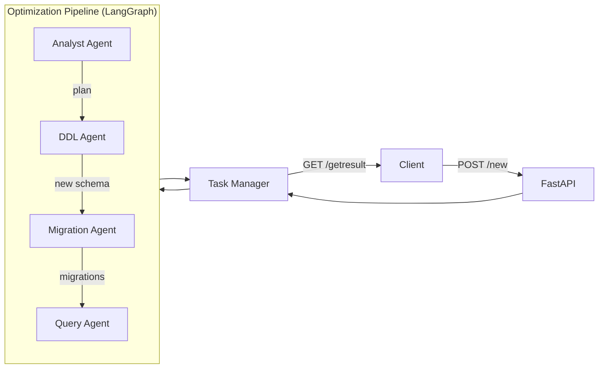

# AI SQL Optimizer

[](https://www.python.org/)
[](https://fastapi.tiangolo.com/)
[](https://github.com/langchain-ai/langgraph)
[](https://www.docker.com/)
[](LICENSE)

LLM-powered service that automatically optimizes database schemas and SQL queries for **Data Lakehouse** environments (Trino, Apache Iceberg, S3).

The service analyzes your DDL statements and SQL query workload, then generates optimized schemas, migration scripts, and rewritten queries using a multi-agent AI pipeline.

---

## Architecture


```mermaid
flowchart LR
    Client -->|POST /new| API[FastAPI]
    API --> TM[Task Manager]
    TM --> Pipeline

    subgraph Pipeline["Optimization Pipeline (LangGraph)"]
        direction TB
        A[Analyst Agent] -->|plan| B[DDL Agent]
        B -->|new schema| C[Migration Agent]
        C -->|migrations| D[Query Agent]
    end

    Pipeline --> TM
    TM -->|GET /getresult| Client
```

**4-agent pipeline:**
1. **Analyst** — analyzes schema & query patterns, produces optimization plan
2. **DDL** — generates optimized CREATE TABLE / MV statements
3. **Migration** — generates INSERT INTO ... SELECT migration scripts
4. **Query** — rewrites each query for the new schema

---

## Quick Start

```bash
git clone https://github.com/ashromanov/ai-sql-optimizer.git
cd ai-sql-optimizer/llm-service

cp .env.example .env
# Edit .env — set your GOOGLE_API_KEY (or configure OpenRouter)

docker compose up -d
```

Service available at `http://localhost:8000` | Swagger: `http://localhost:8000/docs`

---

## Configuration

| Variable | Default | Description |
|----------|---------|-------------|
| `LLM_PROVIDER` | `gemini` | `gemini`, `openrouter`, or `openai_compatible` |
| `GOOGLE_API_KEY` | — | Google API key (required for Gemini) |
| `GEMINI_MODEL` | `gemini-2.5-flash` | Gemini model name |
| `OPENAI_API_KEY` | — | API key for OpenRouter / OpenAI-compatible |
| `OPENAI_BASE_URL` | `https://openrouter.ai/api/v1` | Base URL for OpenAI-compatible API |
| `OPENAI_MODEL` | `google/gemini-2.5-flash` | Model name for OpenRouter |
| `TASK_TTL_SECONDS` | `3600` | Time before completed tasks are cleaned up |
| `WORKERS` | `1` | Uvicorn worker count |

---

## API

### Create optimization task

```
POST /new
```

```json
{
  "url": "jdbc:trino://host:443/catalog",
  "ddl": [
    { "statement": "CREATE TABLE flights (id BIGINT, carrier VARCHAR, ...)" }
  ],
  "queries": [
    {
      "queryid": "10ba3c04-0f91-4ef3-a717-c1e0d33b31bc",
      "query": "SELECT carrier, COUNT(*) FROM flights GROUP BY carrier",
      "runquantity": 795,
      "executiontime": 20
    }
  ]
}
```

Response: `{ "taskid": "c8ed3309-1acb-439a-b32b-f802ba41db3e" }`

### Check task status

```
GET /status?task_id={taskid}
```

Response: `{ "status": "RUNNING" | "DONE" | "FAILED" }`

### Get results

```
GET /getresult?task_id={taskid}
```

```json
{
  "ddl": [{ "statement": "CREATE TABLE optimized_flights (...)" }],
  "migrations": [{ "statement": "INSERT INTO optimized_flights SELECT ..." }],
  "queries": [{ "queryid": "...", "query": "SELECT ... (optimized)" }]
}
```

---

## Tech Stack

| Category | Technology |
|----------|-----------|
| Language | Python 3.13 |
| Framework | FastAPI + Uvicorn + uvloop |
| AI/ML | LangGraph, LangChain, Google Gemini |
| SQL | sqlglot (with Rust backend) |
| DI | Dishka |
| Infrastructure | Docker, Docker Compose |
| Test Stack | Trino + Hive Metastore + Apache Iceberg + MinIO S3 |

---

## Development

```bash
cd llm-service
uv sync
uv run uvicorn src.main:app --reload --port 8000
```

### Test Infrastructure (Trino + Iceberg)

```bash
cd test-system/deploy
docker compose up -d
```

Deploys MinIO (S3), PostgreSQL, Hive Metastore, and Trino with Iceberg catalog.

---

## Contacts

[](https://t.me/ShadowP1e)
[](https://t.me/iwance)
[](https://t.me/Ashromanov)
